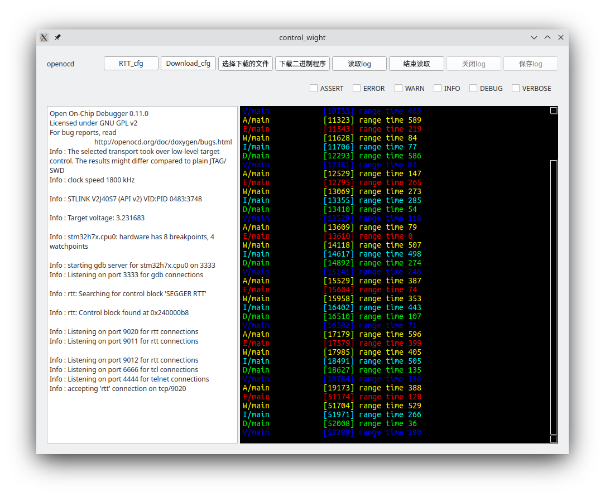

# 这个项目实现了什么功能
实现了通过图形交互界面完成程序的下载和RTT消息的显示与保存。
## 下载二进制程序的执行步骤
点击`download_cfg`按钮，选择相应的后缀为`.cfg`的文件

点击`选择下载的文件`按钮，选择将要对微控制器下载的二进制程序文件

点击`下载二进制程序`按钮，完成程序的下载

程序会自动记录上一次选择的`.cfg`文件和二进制程序文件，再次打开程序时之需要点击`下载二进制程序`按钮，程序会自动下载上一次下载的二进制程序文件

## RTT消息的读取的执行步骤
点击`RTT_cfg`按钮，选择相应的后缀为`.cfg`的文件

点击`读取log`按钮，开始读取微控制器通过RTT输出的log

程序也会自动记录上一次选择的`RTT_cfg`文件


```
RTT 是SEGGAR公司推出的用于嵌入式系统监控和交互的工具，openocd也提供了对于RTT的支持。
```

# 程序工作原理
常用的openocd命令格式
`openocd -f file.cfg`

在`file.cfg`中添加`SEGGER RTT`相关参数，主要是内存搜索起始地址和搜索长度，输出端口。
```
source [find interface/stlink.cfg] 
transport select hla_swd
source [find target/stm32h7x.cfg]

# download speed = 10MHz
adapter speed 10000
init
rtt setup 0x24005000 0x1000 "SEGGER RTT"
rtt start
rtt server start 9010 0
rtt server start 9011 1
```
`stlink.cfg`指明调试器是什么调试器,
`stm32h7x.cfg`指明嵌入式芯片的名称,
`0x24005000`是内存搜索起始地址,
`0x1000`是搜索长度。

成功搜索到后`openocd`会打印如下提示：

需要另开一个命令行执行`telnet localhost 9010`查看芯片`stm32h7x`输出的log。

# TODO
1. ~~将`openocd`的标准输出和标准错误都打印在控制台上~~
2. ~~记录芯片输出log~~
3. ~~识别`openocd`的标准输出和标准错误,判断时候是否正确连接芯片调试功能//我感觉好像只有标准错误输出，？？？~~
4. ~~识别`RTT`是否找到成功//这个功能没有做，和下一个是重复的~~
5. ~~识别端口号，并自动连接~~
6. ~~给log文件添加颜色显示，`elog_assert`、`elog_error`、`elog_warn`、`elog_info`、`elog_debug`、`elog_verbose`都有不同的颜色表示~~
7. stm32核心异常的时候输出寄存器，pc指针，方便判断异常类型。
8. ~~目前输出的log在控制台是有颜色的，界面中是没有颜色的，需要添加颜色现实，也就是第6项~~
9. 因为不断的添加显示的内容，所以光标一直在跳动，需要让光标不再跳动
10. ~~烧录程序的按钮也是需要去添加的~~
11. ~~记录上一次的配置文件位置和烧录的文件的位置，（想要记录，就一定要有一个固定位置的文件记录配置信息）~~


# 关于linxu
其实我仔细想了一下这个程序有什么用，对于熟悉命令行的人，其实这个程序是没有多大作用的，对于想要使用界面的
人，这个程序还是有点作用的，减少了了解更多需要的内容。

linux程序应该是什么样子的呢？每个都是小程序，小程序有清晰的输入和输出，可以通过管道或者进程间通信，完成输入和输出，可以同时被多个程序同时调用（多线程安全），小程序的组合能发挥很大的作用，比大程序要好的多。

# 这个程序的后续规划
多个小程序的组合比一个很大的程序要好的的。
既然这个一个log显示记录的工具，目前是通过调试接口（SEGGER_RTT）输出log的，还可以通过串口输出信息（通过串口输出信息，需要注意SysTick中断与串口中断的相互影响），需要把记录log的功能单独提取出来，通过`openocd`输出log是可以调用记录log的代码，通过串口输出的时候也可以调用记录log的代码，
## 调用记录log的代码需要提供的功能
1. 调用时首先需要配置进程间通信的接口
2. 需要确定进程间通信的方法
3. 还需要保存文件 
## 显示部分应该由谁来做，怎么做？
有两种解决办法
第一种是直接传保存代码前就先去显示
优势：消耗系统资源少
劣势：被保存的log的类型会被严格限制
第二种是保存到文件后返回文件名，然后再去读取文件显示
第二种方案的优势和劣势就完全反了过来，消耗资源大，但是灵活性更多，因为是用读取文件的工具显示，可以做的选择很多，
我现在用的是第一种方案，可以给第二个方法预留一个接口的位置，等到后面需要的时候再去用

